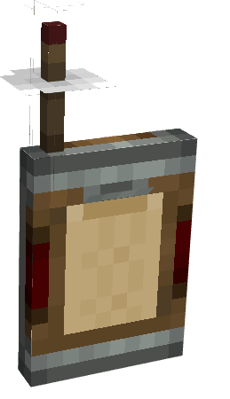

# Portable Stock Ticker

The **Portable Stock Ticker** is a handheld device that integrates with a Create mod network, allowing players to request packages remotely.
Once linked to a **Stock Ticker** or a **Stock Link**, it provides a **Stockkeeper interface**, enabling players to request items on the go without needing direct access to a Stockkeeper.
Key Features:

* **Remote Item Requesting** via Stockkeeper interface
* **JEI-synchronized search**
* **Crafting support** within the request interface
* **Category synchronization**: If linked to a Stock Ticker with categories, those categories will be copied to the Portable Stock Ticker

