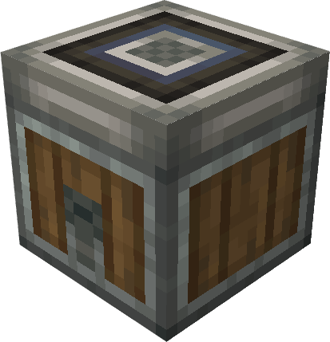

# Robo Bee Port

The **Robo Bee Port** is a specialized block that automates the delivery of Create mod Packages to players or other Robo Bee Ports.

Key Features:

* **Package delivery system** that reads address labels and send a bee with the packages to players or other Bee Ports
* **Insert packages manually or automatically** using Funnels, Chutes, or Hoppers
* **Pull packages** from adjacent inventories if not powered by redstone
* **Push packages** to adjacent inventories if powered by redstone

  
