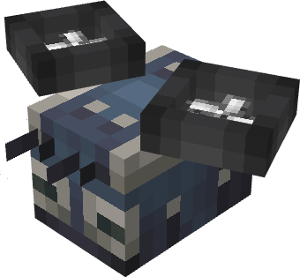

# Robo Bee

The **Robo Bee** is an entity that delivers Create mod Packages to their destination. It follows the address on the package, delivering directly to players or between Bee Ports as needed.\
\
Key Features:

* **Spawned using the item**
* **Required by Bee Ports** to send packages
* **Carries packages** directly to players or between Bee Ports

  
